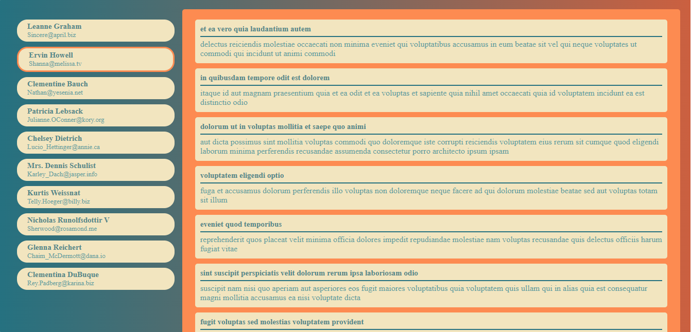

# challange-one-tarmeez-academy---callback-Json-Placeholder-API-AJAX
this is a simple Json-Placeholder-API-AJAX Project trying to (get All Posts / get All Users / get All Posts For Spacific User). it contains html,css and Js file.

## Table of contents

- [Overview](#overview)
- [Installation](#Installation)
- [Links](#Links)
- [Screenshot](#Screenshot)
- [What I learned](#what-i-learned)
- [Continued development](#continued-development)
- [Author](#author)
- [Acknowledgments](#Acknowledgments)


## overview
this is a simple Json-Placeholder-API-AJAX Project trying to (get All Posts / get All Users / get All Posts For Spacific User). it contains html,css and Js file.

## Installation
To get started with this project, follow these steps:

you can clone the project or download it as Zip file.
 Clone the repository:
   ```bash
   git clone https://github.com/olahasan/challange-one-tarmeez-academy---callback-Json-Placeholder-API-AJAX
```

## Links

If you want to open the link in a new tab, you can:

- Press **Ctrl** (or **Cmd** on Mac) while clicking the link.
- Right-click the link and select **Open link in new tab**.

Otherwise, all links will open in the same tab.

- Solution URL: [here](https://github.com/olahasan/challange-one-tarmeez-academy---callback-Json-Placeholder-API-AJAX)

- Live Site URL: [here](https://olahasan.github.io/challange-one-tarmeez-academy---callback-Json-Placeholder-API-AJAX/)


 ## Screenshot
 



## what-i-learned
Through this project:
-I learned how to create Json-Placeholder-API-AJAX in js.
- how to get All Posts , get All Users .
- how to get All Posts For Spacific User after clicked on this post
- create function that create an element to add it to DOM
- how to collect between html,css and Js file.
- how to push it on github + gh-pages

## Continued Development
In the future, I plan to:
- do the same project using another way dealing with API like (fetch, axios, async/await)
- learn reactJs and ....

### Author

GitHub - @olahasan
**[olahasan](https://github.com/olahasan)**

### Acknowledgments

I would like to thank the **[tarmeez academy](https://www.youtube.com/@tarmeez)** for providing this challenge and to the community for their support.
